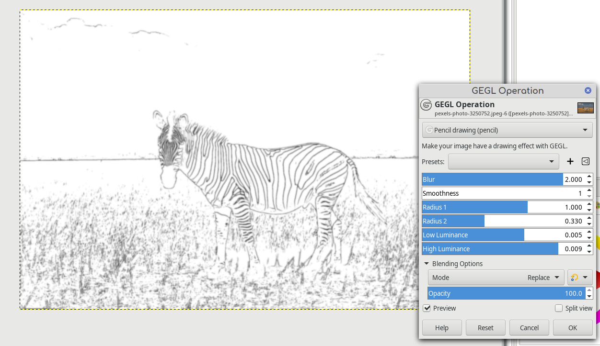

gegl:pencil
=========

A custom GEGL operation (and by extension GIMP filter) renders a basic pencil drawing. Beaver programmed the filter while Gimp Chat user 
cli345 discovered the gegl graph algorithm. 


## Compiling and Installing

### Linux

To compile and install you will need the GEGL header files (`libgegl-dev` on
Debian based distributions or `gegl` on Arch Linux) and meson (`meson` on
most distributions).

```bash
meson setup --buildtype=release build
ninja -C build
cp build/high-pass-box.so ~/.local/share/gegl-0.4/plug-ins
```

If you have an older version of gegl you may need to copy to `~/.local/share/gegl-0.3/plug-ins`
instead (on Ubuntu 18.04 for example).


### Windows

The easiest way to compile this project on Windows is by using msys2.  Download
and install it from here: https://www.msys2.org/

Open a msys2 terminal with `C:\msys64\mingw64.exe`.  Run the following to
install required build dependencies:

```bash
pacman --noconfirm -S base-devel mingw-w64-x86_64-toolchain mingw-w64-x86_64-meson mingw-w64-x86_64-gegl
```

Then build the same way you would on Linux:

```bash
meson setup --buildtype=release build
ninja -C build
```


